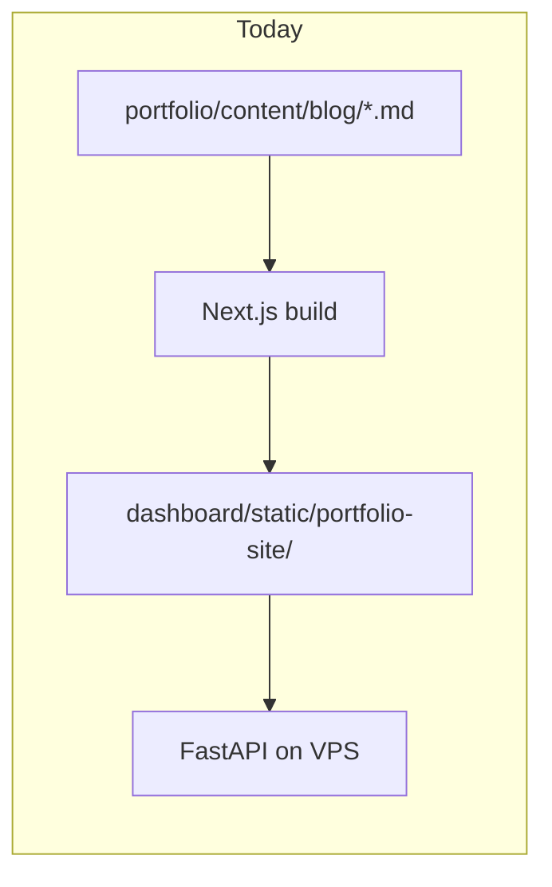
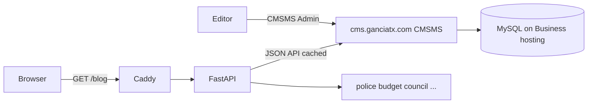

# Feature Implementation Plan

**Overall Progress:** `0%`

## TLDR

Evaluate adding **CMS Made Simple (CMSMS)** as a **content backend** for **ganciatx.com** — primarily the **blog** and any future marketing pages — while keeping the existing **FastAPI + Next.js portfolio + civic apps** stack on the VPS. CMSMS would run on **Hostinger Business** (PHP/MySQL), similar to the already-planned WordPress approach in [`WORDPRESS_BLOG_PLAN.md`](./WORDPRESS_BLOG_PLAN.md). Editors get a browser-based admin; visitors still see your current site design.

## Critical Decisions

- **Decision 1: CMSMS as content backend, not app host** — Your civic tools (police map, council accountability, budget simulators) stay in FastAPI/Docker on the VPS. CMSMS only replaces **git-managed markdown** (`portfolio/content/blog/`) and static config edits for content that changes often.

- **Decision 2: Headless integration required** — CMSMS has **no built-in REST API**. Integration means either (a) a **custom CMSMS module** exposing JSON routes, or (b) **subdomain + reverse proxy** with CMSMS rendering its own templates. Option (a) matches your existing architecture; option (b) is faster to stand up but splits design/styling.

- **Decision 3: Hostinger Business for PHP** — Same split as WordPress plan: apex `ganciatx.com` → VPS Docker; CMSMS subdomain (e.g. `cms.ganciatx.com` or `blog.ganciatx.com`) → shared Business hosting. Keeps PHP/MySQL off the KVM 1 VPS.

- **Decision 4: WordPress vs CMSMS** — You already have a WordPress headless plan with a mature REST API (`/wp-json/wp/v2/posts`). CMSMS is lighter and Smarty-centric but needs **custom API work**. Choose CMSMS only if you prefer its templating model, smaller footprint, or want to avoid WordPress — not because it integrates more easily.

## What You Gain (Benefits)

| Benefit | Today (markdown + static export) | With CMSMS |
|---------|----------------------------------|------------|
| **Publish without deploy** | Edit `.md` → commit → Docker rebuild → redeploy | Edit in browser; FastAPI cache refresh (~minutes) |
| **Non-developer editing** | Requires git, markdown, build pipeline | Web admin for editors |
| **Draft / schedule workflow** | Manual (git branches or unpublished files) | Built-in draft states via News module |
| **Reusable content blocks** | Copy-paste or shared components in code | Global blocks editable once, used on many pages |
| **Media library** | Images in `portfolio/public/` | Upload/manage assets in admin |
| **Page expansion** | New Next.js routes + rebuild | Add CMS pages without touching React (if headless) |
| **Open source, no WP lock-in** | N/A (files in repo) | PHP CMS you host; modular addon ecosystem |
| **Design control** | Full control in Next.js | Smarty templates (CMSMS-native) or your Next.js skin (headless) |

**Best fit for your site:** Blog posts, landing copy, announcements, and occasional static pages — **not** the interactive DalCiv apps (those remain code).

**What you do *not* gain vs staying on markdown:** Version control in git, zero server maintenance, instant local preview, or a turnkey API (WordPress and headless CMS products ship that; CMSMS does not).

## Current vs Target Architecture

## Integration Options

### Option A — Headless (recommended if CMSMS is chosen)

Mirrors [`WORDPRESS_BLOG_PLAN.md`](./WORDPRESS_BLOG_PLAN.md):

1. Install CMSMS on Hostinger Business at `cms.ganciatx.com` (or reuse `blog.ganciatx.com`).
2. Use the **News module** (or core pages) for posts.
3. Build a small **custom CMSMS module** (`RegisterRoute` + JSON actions) exposing:
   - `GET /api/news` — list posts (title, slug, excerpt, date, category)
   - `GET /api/news/{slug}` — full post body + metadata
4. Add `dashboard/cmsms_blog.py` — fetch, normalize, disk cache (`scraper_dashboard_data/cmsms_posts_cache.json`), stale-while-revalidate (same pattern as Socrata caches).
5. **Rendering choice:**
   - **5a (minimal change):** FastAPI Jinja templates at `/blog` + `/blog/{slug}` (reuse styling from portfolio export or `home.html`).
   - **5b (keep Next.js look):** Next.js `getStaticProps` / build-time fetch from CMSMS API → still requires rebuild on publish unless you move blog routes to FastAPI SSR.

### Option B — Subdomain with CMSMS templates (fastest, split design)

1. CMSMS serves `https://blog.ganciatx.com` with Smarty templates styled to match portfolio.
2. `ganciatx.com/blog` → **redirect** or **Caddy reverse_proxy** to subdomain.
3. No custom API module; editors use CMSMS admin; visitors leave the Next.js shell on blog pages.

### Option C — Replace markdown at build time only

1. CMSMS JSON module as in Option A.
2. CI/CD step: fetch posts during `npm run build` in `portfolio/` → generate static HTML (keeps current static export model).
3. **Tradeoff:** Still need redeploy to show new posts (defeats main CMS benefit unless you add Option A runtime fetch).

## Tasks

- [ ] 🟥 **Step 1: Decide CMSMS vs WordPress vs keep markdown**
  - [ ] 🟥 Compare: API maturity (WP REST vs custom CMSMS module), editor UX, hosting cost, maintenance
  - [ ] 🟥 Confirm subdomain: `blog.ganciatx.com` vs `cms.ganciatx.com`
  - [ ] 🟥 If WordPress REST is sufficient, prefer existing [`WORDPRESS_BLOG_PLAN.md`](./WORDPRESS_BLOG_PLAN.md) and skip CMSMS

- [ ] 🟥 **Step 2: CMSMS on Hostinger Business**
  - [ ] 🟥 hPanel → install CMS Made Simple 2.2.x on Business hosting (PHP 8.2+, MySQL)
  - [ ] 🟥 DNS: subdomain A/CNAME → Business hosting (apex stays VPS `168.231.65.105`)
  - [ ] 🟥 HTTPS on subdomain; create editor account; install **News** module
  - [ ] 🟥 Publish 2–3 test posts; verify admin workflow

- [ ] 🟥 **Step 3: Custom JSON API module (Option A only)**
  - [ ] 🟥 Create CMSMS module with `RegisterRoute` for `/api/news` and `/api/news/{slug}`
  - [ ] 🟥 Return JSON (clear buffers, `Content-Type: application/json`, `exit` after output)
  - [ ] 🟥 Map News fields → `{ title, slug, excerpt, content, date, category, image }`
  - [ ] 🟥 Document module in repo under `deploy/cmsms/` (optional: git submodule of module source)

- [ ] 🟥 **Step 4: FastAPI client + cache**
  - [ ] 🟥 New `dashboard/cmsms_blog.py` — fetch list + by slug, normalize payloads
  - [ ] 🟥 Cache: `scraper_dashboard_data/cmsms_posts_cache.json`; TTL ~10–15 min
  - [ ] 🟥 Register refresh job in `dashboard/data_sync.py`; env `CMSMS_BASE_URL` in `.env.example`
  - [ ] 🟥 Routes in `dashboard/app.py`: `GET /blog`, `GET /blog/{slug}`, `GET /api/blog/posts` (may supersede static portfolio blog routes)

- [ ] 🟥 **Step 5: Public UI**
  - [ ] 🟥 Jinja templates `blog_index.html` / `blog_post.html` matching portfolio tokens, **or** update Next.js to consume API at build time
  - [ ] 🟥 Sanitize HTML content from CMSMS (bleach allowlist)
  - [ ] 🟥 Update `portfolio` nav if blog moves off static export; keep `/blog` consistent in Header/Footer

- [ ] 🟥 **Step 6: Deploy and verify**
  - [ ] 🟥 Redeploy `dalciv` on VPS; no Caddy change for headless Option A
  - [ ] 🟥 For Option B: add Caddy `reverse_proxy` or redirect for `/blog` → subdomain
  - [ ] 🟥 Verify: publish in CMSMS → appears on `/blog` within cache TTL
  - [ ] 🟥 Update `README.md` and [`docs/DEPLOYING_UPDATES.md`](../docs/DEPLOYING_UPDATES.md)

## Out of Scope (v1)

- Running CMSMS inside Docker on the VPS (PHP/MySQL stack competes with FastAPI resources)
- Migrating civic apps into CMSMS
- Comments, search, or SEO plugin parity with WordPress
- Replacing `portfolio/src/lib/content.ts` site config (name, apps catalog) — keep in code unless you add a second CMS content type

## Rollback

Remove FastAPI blog routes and sync job; point `/blog` back to static portfolio export (`portfolio/content/blog/`). CMSMS instance on Hostinger can remain independent.

## Key Files

| Path | Role |
|------|------|
| Hostinger hPanel | CMSMS + MySQL + DNS |
| `deploy/cmsms/` (new) | Custom JSON API module source |
| `dashboard/cmsms_blog.py` (new) | Fetch + cache client |
| `dashboard/app.py` | `/blog` routes |
| `dashboard/data_sync.py` | Background cache refresh |
| `portfolio/content/blog/` | Current source of truth until migration |
| [`plans/WORDPRESS_BLOG_PLAN.md`](./WORDPRESS_BLOG_PLAN.md) | Alternative with native REST API |
