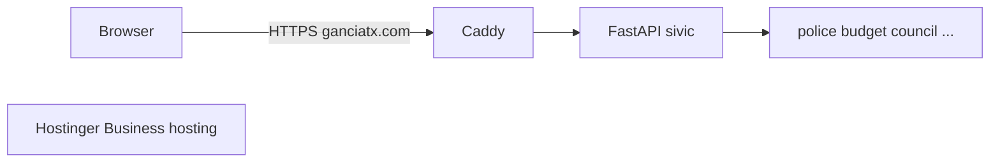
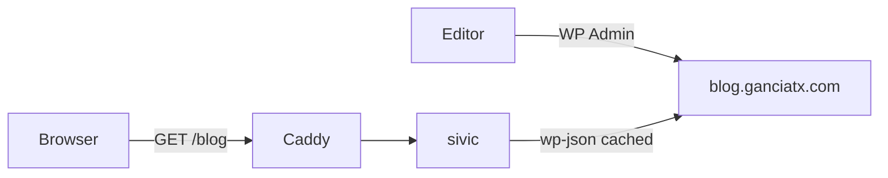

# Feature Implementation Plan

**Overall Progress:** `0%`

## TLDR

Add a **Blog** on **https://ganciatx.com/blog** that displays posts from **WordPress** on **Hostinger Business** at **blog.ganciatx.com**. Editors use WordPress admin; visitors see a DALCIV-styled listing and post pages. The FastAPI app fetches the [WordPress REST API](https://developer.wordpress.org/rest-api/) and caches responses so pages load quickly—same stale-while-revalidate idea as the Socrata data sync.

## Critical decisions

- **WordPress on Hostinger Business (`blog.ganciatx.com`)** — Keeps PHP/MySQL off the KVM 1 VPS; apex `ganciatx.com` stays on Docker (Caddy → sivic).
- **Headless (REST API), not reverse-proxy** — `/blog` rendered in this repo (Jinja templates matching [`dashboard/templates/home.html`](../dashboard/templates/home.html)); WordPress does not need to match DALCIV theme.
- **Server-side fetch + disk cache** — Short TTL (~10–15 min) + optional background job in [`dashboard/data_sync.py`](../dashboard/data_sync.py); public posts only via `GET /wp/v2/posts`.
- **URLs** — Index: `/blog`; post: `/blog/{slug}`; JSON: `/api/blog/posts`.

## Current state

| Resource | Role |
|----------|------|
| VPS `168.231.65.105` | [`deploy/caddy/Caddyfile`](../deploy/caddy/Caddyfile) → sivic |
| Business hosting | Landing subdomain; **target for WordPress** |
| Portal | [`dashboard/templates/home.html`](../dashboard/templates/home.html) — no blog card yet |

## Target architecture

## Tasks

- [ ] 🟥 **Step 1: WordPress on Hostinger (CMS)**
  - [ ] 🟥 hPanel → Business hosting → install WordPress for **blog.ganciatx.com**
  - [ ] 🟥 DNS: `blog` record → shared hosting (apex remains VPS)
  - [ ] 🟥 HTTPS on blog subdomain; permalinks **Post name**
  - [ ] 🟥 Publish test posts; verify `https://blog.ganciatx.com/wp-json/wp/v2/posts?per_page=5`

- [ ] 🟥 **Step 2: Backend — client and cache**
  - [ ] 🟥 New [`dashboard/wordpress_blog.py`](../dashboard/wordpress_blog.py) — fetch list + by slug, normalize title/excerpt/content/date/featured image (`_embed=wp:featuredmedia`)
  - [ ] 🟥 Cache: `scraper_dashboard_data/wordpress_posts_cache.json`; `cache_warming` when empty
  - [ ] 🟥 Register `wordpress_blog` job in [`dashboard/data_sync.py`](../dashboard/data_sync.py) — `BLOG_SYNC_INTERVAL_SEC` in [`.env.example`](../.env.example)
  - [ ] 🟥 Env: `WP_BASE_URL=https://blog.ganciatx.com` (optional app password for future drafts)

- [ ] 🟥 **Step 3: Routes and templates**
  - [ ] 🟥 [`dashboard/app.py`](../dashboard/app.py): `GET /blog`, `GET /blog/{slug}`, `GET /api/blog/posts`
  - [ ] 🟥 [`dashboard/templates/blog_index.html`](../dashboard/templates/blog_index.html), [`blog_post.html`](../dashboard/templates/blog_post.html) — portal styling; sanitize `content.rendered` (bleach allowlist)

- [ ] 🟥 **Step 4: Portal and ops**
  - [ ] 🟥 Blog card on [`home.html`](../dashboard/templates/home.html); “Apps” nav on other pages
  - [ ] 🟥 WP cache/sync row in [`dashboard/command_center.py`](../dashboard/command_center.py) → `/command`
  - [ ] 🟥 Update [`README.md`](../README.md), [`docs/DEPLOYING_UPDATES.md`](../docs/DEPLOYING_UPDATES.md)

- [ ] 🟥 **Step 5: Deploy and verify**
  - [ ] 🟥 Redeploy **dalciv** on VPS (no Caddy change for headless)
  - [ ] 🟥 Verify: `/blog`, `/blog/{slug}`, `/api/blog/posts`; no mixed-content images

## Out of scope (v1)

- WordPress in Docker on the VPS
- Comments, categories UI, site search
- Yoast/SEO plugin fields
- Replacing [`deploy/hostinger-landing/`](../deploy/hostinger-landing/)

## Rollback

Remove routes and portal card; disable blog sync job. WordPress on Hostinger can stay up independently.

## Key files

| Path | Change |
|------|--------|
| Hostinger hPanel | WordPress + DNS |
| `dashboard/wordpress_blog.py` | REST client + cache |
| `dashboard/app.py` | Routes |
| `dashboard/templates/blog_*.html` | Public UI |
| `dashboard/templates/home.html` | Portal link |
| `dashboard/data_sync.py` | Background refresh |
